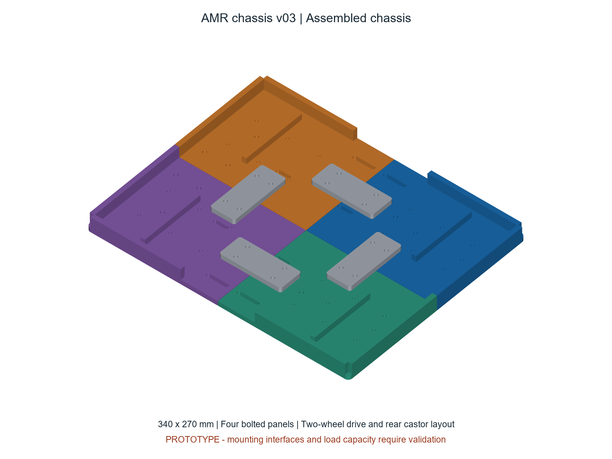
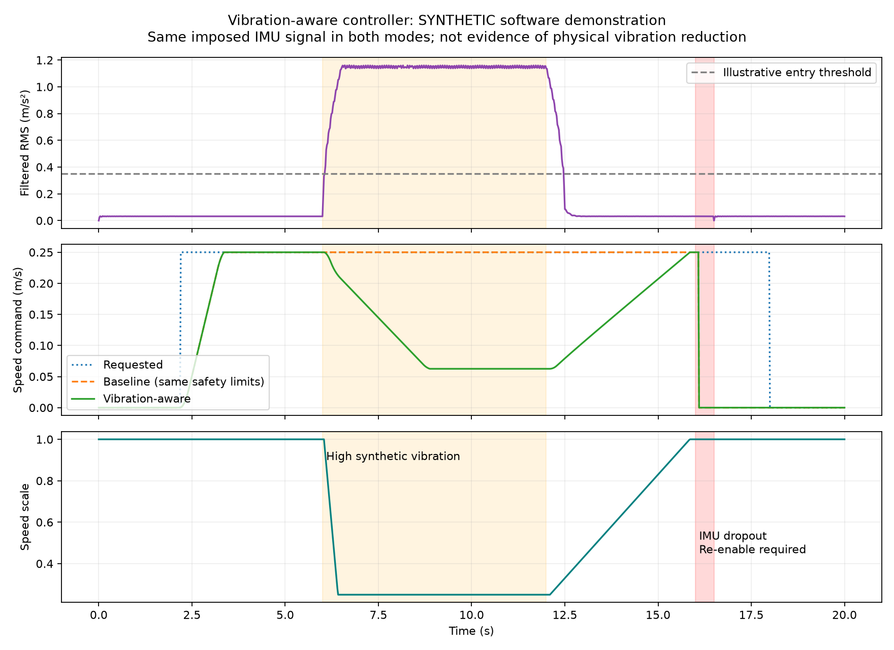

# Vibration-Aware Autonomous Mobile Robot

An Individual Major Project investigating whether payload-IMU feedback and bounded motion adaptation can reduce vibration during indoor transport of a representative fragile payload.

The robot is a **custom two-wheel differential-drive platform with a rear castor**, a proposed isolated payload deck and a **1 kg total carried-load target**. It is not a TurtleBot. A Raspberry Pi 5 is available; ROS 2 navigation and hardware integration are planned.

**Current stage: IMP Part B, prototype CAD and offline software testing. Physical construction and experimental validation have not been completed.**



## What is here

| Folder | Contents | Evidence status |
| --- | --- | --- |
| [cad/chassis_v03](cad/chassis_v03) | Split chassis STEP assembly, individual STLs, CAD generator, previews and geometry checks | Validated file geometry; mounting fit and load capacity untested |
| [cad/concept_v02](cad/concept_v02) | Earlier Fusion assembly, STEP, coloured subsystem sheets and Fusion generator | Historical full-robot concept, not fabrication-ready |
| [software/vibration_aware_control](software/vibration_aware_control) | Python controller core, ROS 2 adapter, configuration, unit tests and synthetic demo | 20 offline tests passed; ROS runtime and hardware untested |
| [simulation/four_wheel_alternative](simulation/four_wheel_alternative) | MATLAB kinematics and analytical outputs for the earlier skid-steer alternative | Not the current two-wheel chassis model |
| [docs](docs) | Project status, next steps and repository scope | Planning documentation |

## Start here

- **Fusion:** import [AMR_Chassis_v03_Assembly.step](cad/chassis_v03/AMR_Chassis_v03_Assembly.step). The STEP preserves solids, not a Fusion feature timeline. Read the [chassis notes](cad/chassis_v03/READ_ME_FIRST.md) before editing or printing.
- **Printing:** the four main panels are 169.8 by 134.8 mm. A 220 by 220 mm usable bed is a provisional assumption. Start with the small hole-fit coupon after confirming the printer and material. Motor-specific mounts, castor mounting details and structural validation remain outstanding.
- **Controller:** run the ROS-independent tests with Python 3.10 or newer:

```sh
cd software/vibration_aware_control
python -m unittest discover -s tests -v
python -m vibration_aware_control.demo
```

The tests and CSV demo require only Python's standard library. Install `matplotlib` if a regenerated chart is wanted. The existing demo outputs are already included.



Both demo modes receive the same imposed vibration input. The chart demonstrates command adaptation and a sensor-dropout stop; it does **not** demonstrate achieved physical vibration reduction.

## Planned architecture

Ubuntu 24.04 and ROS 2 Jazzy on the Pi 5; Gazebo Harmonic on the development PC; SLAM Toolbox, Nav2 with DWB, encoder/IMU odometry, ArUco docking and rosbag2 logging. A microcontroller handles wheel-speed control and an independent command watchdog. A hardwired emergency stop removes motor power independently of ROS.

The vibration-aware function adapts driving commands using payload acceleration. Passive elastomer isolation is planned. **Active vibration cancellation is not part of the core implementation.**

The planned experiment targets at least 20% lower RMS vibration with no more than 20% additional journey time. These are research targets, not results. Measurement definitions, gravity removal, matched-trial conditions and dataset counting must be fixed before trials.

## Before physical use

Confirm component dimensions, motor/driver ratings, battery and regulated power supplies, fasteners, print material, stability and laboratory risk controls. The CAD geometry checks are not FEA, proof-loading or a 1 kg capacity certification. The software is not safety-rated and must not be connected to powered wheels without supervised commissioning.

See [project status and next steps](docs/PROJECT_STATUS.md) for the current gaps. Academic submissions and personal forms are intentionally kept outside this repository. No new open-source licence has been selected.
